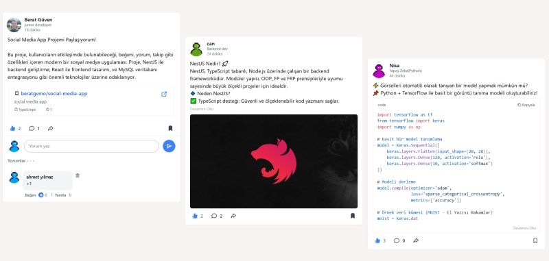
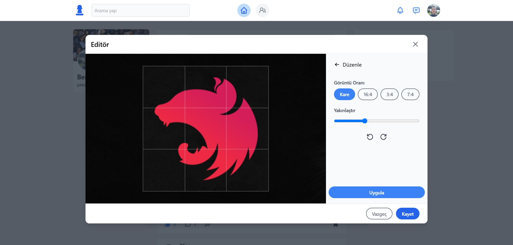
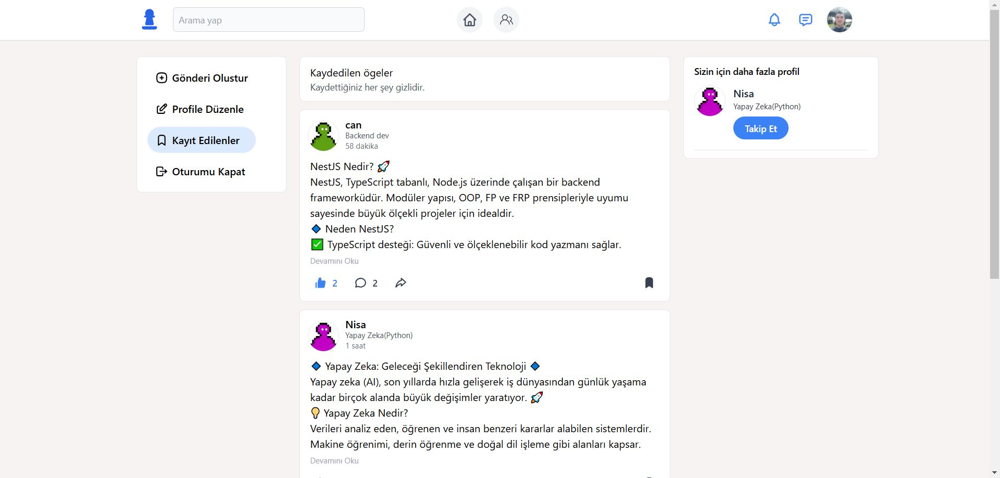

# Social Media App

<p align="center">
  <a href="http://nestjs.com/" target="blank"></a>
  <a href="https://reactjs.org/" target="blank"></a>
</p>

<p align="center">
  
  
  
  
</p>

<p align="center">
  
  
  
  
</p>

## Description

This is a full-stack social media application built with [NestJS](https://nestjs.com/) for the backend and [React](https://reactjs.org/) with [Vite](https://vitejs.dev/) for the frontend. The application allows users to create posts, follow other users, like and comment on posts, and chat in real-time.

## Features

-   User authentication and authorization
-   Create, edit, and delete posts
-   Follow and unfollow users
-   Like and comment on posts
-   Real-time chat functionality
-   Profile customization with profile and banner images

## Technologies Used

### Backend

-   [NestJS](https://nestjs.com/)
-   [TypeORM](https://typeorm.io/)
-   [JWT](https://jwt.io/)
-   [Socket.IO](https://socket.io/)
-   [MySQL](https://www.mysql.com/)

### Frontend

-   [React](https://reactjs.org/)
-   [Vite](https://vitejs.dev/)
-   [Tailwind CSS](https://tailwindcss.com/)
-   [Socket.IO Client](https://socket.io/docs/v4/client-api/)

## Installation

### Backend

1. Navigate to the `backend` directory:

    ```bash
    cd backend
    ```

2. Install the dependencies:

    ```bash
    npm install
    ```

3. Create a `.env` file and configure your environment variables:

    ```env
    DB_HOST=your_database_host
    DB_PORT=your_database_port
    DB_USERNAME=your_database_username
    DB_PASSWORD=your_database_password
    DB_DATABASE=your_database_name
    JWT_SECRET=your_jwt_secret
    ```

4. Run the application:

    ```bash
    # development
    npm run start

    # watch mode
    npm run start:dev
    ```

### Frontend

1. Navigate to the `frontend` directory:

    ```bash
    cd frontend
    ```

2. Install the dependencies:

    ```bash
    npm install
    ```

3. Run the application:
    ```bash
    npm run dev
    ```
